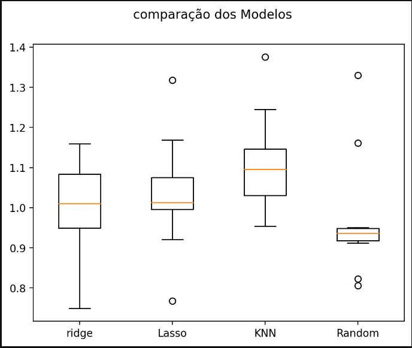
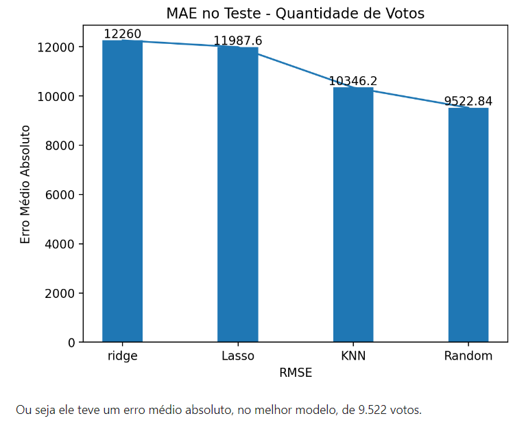
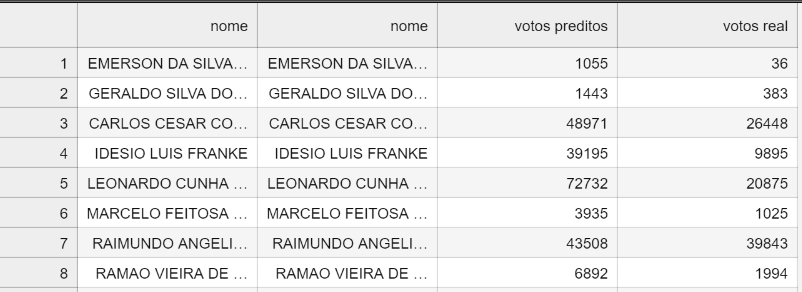

## Tarefa Machine Learning

## Descrição da Tarefa

  

Nesta atividade construiremos modelos preditivos de regressão em scikit learn para a predição dos votos de deputados federais considerando as eleições de 2006, 2010 e 2014. As atividades esperadas para essa etapa são descritas a seguir:

Baixe os dados nesse link: [dados 2006 e 2010](/data/eleicoes_2006_a_2010.csv) e [dados 2014](/data/eleicoes_2014.csv) (veja descrição dos dados mais abaixo).

Considere o pipeline mostrado nesse [link](https://www.kaggle.com/apapiu/regularized-linear-models) para construir seus modelos de regressão. Isso implica, dentre outras coisas:

Analisar as distribuições das variáveis para ver se estão enviesadas e precisam de correção; tratamento de valores ausentes, variáveis categóricas e normalização, quando for o caso.

Construir modelos de regressão com (ridge e lasso) e sem regularização.

Considerar outros modelos ainda não vistos em sala de sua escolha (e.g. SVR, Regression Trees, KNN e Random Florests).

Tunar os hiperâmetros para cada caso e retornar os rmses de validação cruzada para todos os modelos avaliados.

Plotar os resíduos versus predições e analisar se esses plots representam bons indícios da adequabilidade dos modelos a esse problema.

Dica: Uma coisa que você pode fazer é usar os dados de 2006 como treino e os de 2010 como validação. Uma vez encontrados os melhores modelos para 2010 junte 2006+2010, retreine, e aplique o modelo aos dados de 2014 que serão liberados.
Responder:

Dentre os modelos avaliados, qual foi o que deu o melhor resultado nos dados de 2014 em termos de RMSE? Justifique bem sua resposta.

Sobre os dados

Vamos explorar dados sobre as votações que candidatos à Câmara Federal de Deputados receberam nos anos de 2006, 2010 e 2014. Esses dados foram extraídos do TSE, pré-processados e contemplam informações sobre aproximadamente 7.300 candidatos. A descrição de cada atributo é dada mais abaixo.

"sequencial_candidato": (character) id do candidato | "nome": (character) | "uf": (character) | "partido": (character) | "quantidade_doacoes": (integer) | "quantidade_doadores": (integer) número de doadores diferentes | "total_receita": (double) soma em R$ das doações | "media_receita": (double) média das doações | "recursos_de_outros_candidatos/comites": (double) quantia em R$ das doações provenientes de outros candidatos ou comite partidário | "recursos_de_pessoas_fisicas": (double) quantia em R$ das doações provenientes de outros CPFs | "recursos_de_pessoas_juridicas": (double) quantia em R$ das doações provenientes de outros CNPJ | "recursos_proprios": (double) quantia em R$ das doações provenientes do próprio candidato | "recursos_de_partido_politico": (double) quantia em R$ das doações provenientes do partido político do candidato | "votos": (integer) variável alvo. Se refere ao número de votos na campanha de 2006 e 2010 | "quantidade_despesas": (integer) | "quantidade_fornecedores": (integer) número de fornecedores/despesas diferentes | "total_despesa": (double) soma em R$ das despesas de campanha | 
"media_despesa": (double) média das despesas de campanha | "cargo": (character) | "Sexo":  (character) | "grau": (character) grau de instrução do candidato | 
"estado_civil": (character) | "ocupacao": (character) ocupação do candidato

## Resposta

Segue o R2 e o RMSE dos modelos construídos.

Os modelos comparados foram: Ridge, Lasso, KNN e RandomForestRegressor.

O modelo seleciondo foi o RandomForestRegressor, levando em consideração o RMSE e o MAE.

Uma predição com dados de 2014 foi gerado a partir do modelo construído

